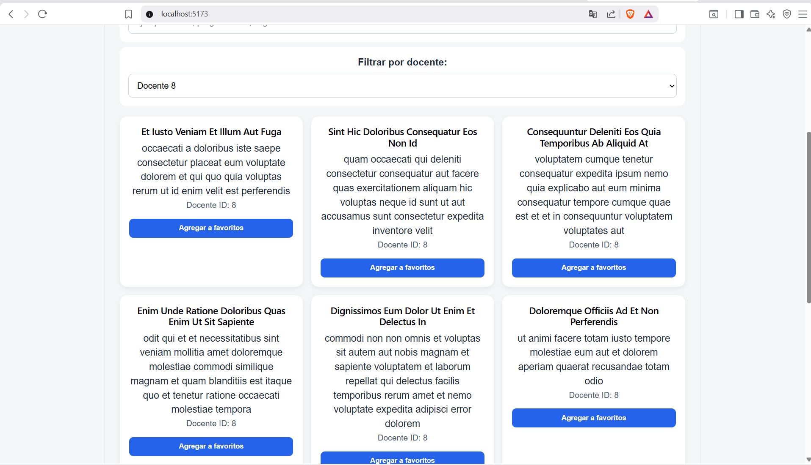
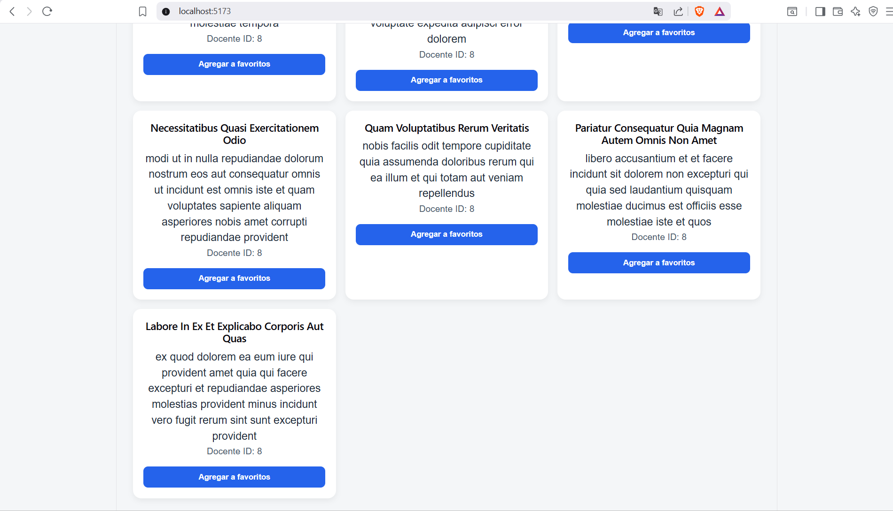
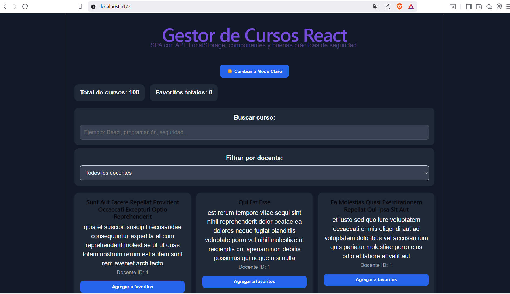
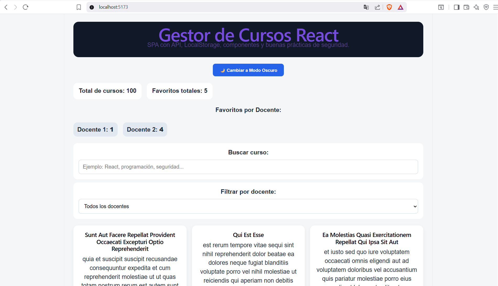
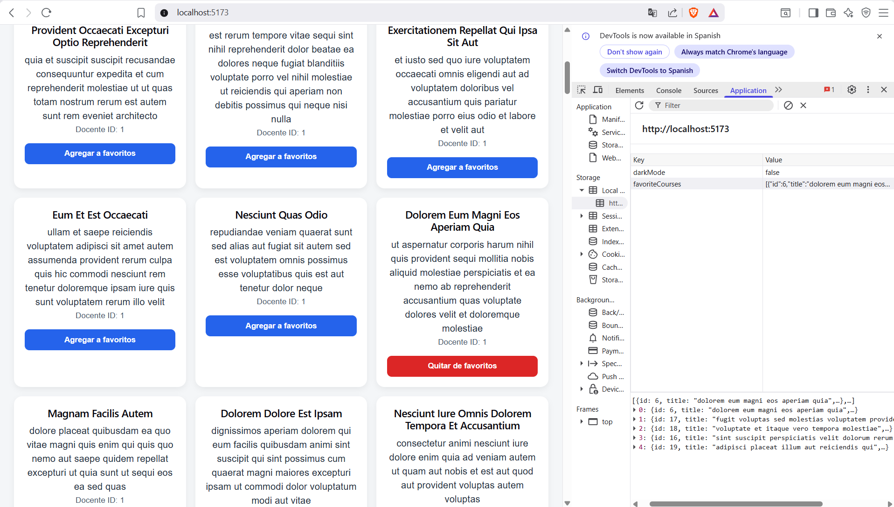
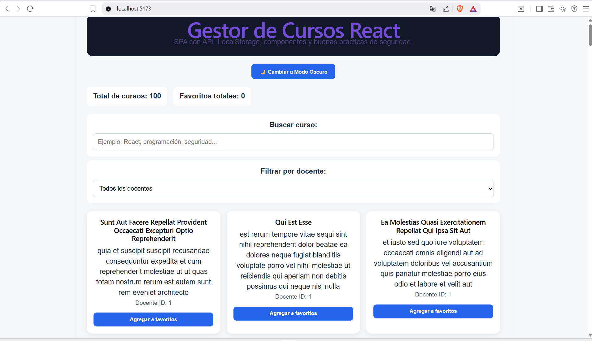
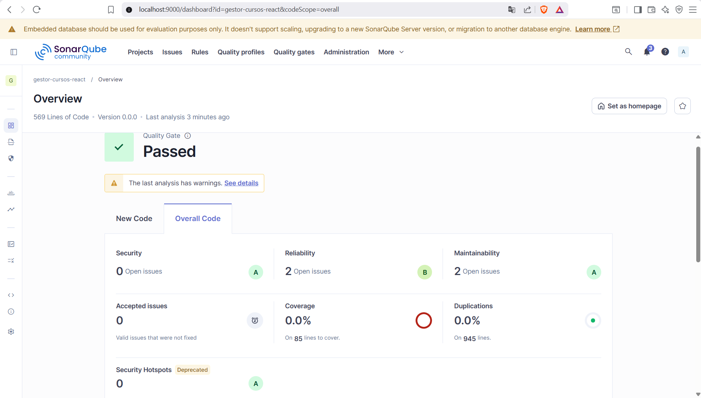

# Entregables: Gestor de Cursos con API, Favoritos y Seguridad SPA

**Estudiante:** [Angler Posada]
**Asignatura:** Front End (Inacap)
**Fecha:** 18 de Julio de 2026
**Profesor:** [Miguel Angel Chacana González]

**Repositorio en Github:** https://github.com/AnglerPosada-30/gestor_cursos_react.git

---

## 1. Evidencia de la Aplicación Funcionando

En estas capturas presento la evidencia del correcto funcionamiento de la interfaz y la exitosa integración de los desafíos adicionales propuestos para la evaluación.

En las primeras imágenes, se puede observar la aplicación operando de manera fluida. Aquí destaco la funcionalidad del Desafío 1: Filtro por docente. Como se aprecia, al seleccionar al 'Docente 8' en el menú desplegable, la vista de la aplicación se actualiza dinámicamente para renderizar de forma exclusiva los cursos asociados a ese ID específico. Esto demuestra que la lógica de filtrado combinada en el estado de React está operando correctamente.

Por otro lado, en la última captura evidencio la implementación del Desafío 3: Modo oscuro. Al interactuar con el botón superior, la paleta de colores de toda la aplicación, incluyendo fondos, textos y tarjetas, se adapta a la perfección (preferencia que además persiste en el LocalStorage). En esta misma vista general, se comprueba la conexión exitosa con la API al cargar el total de los 100 cursos, y se visualiza el panel de resumen superior donde se integraron los contadores dinámicos listos para registrar las interacciones de los usuarios.

## 2. Evidencia de LocalStorage (Favoritos Guardados)

En estas capturas presento la validación de la persistencia de datos y la lógica de agrupación en la aplicación.

En la primera imagen, expongo la interfaz en su modo claro, destacando específicamente la implementación del Desafío 2: Contador por favoritos. Como se aprecia en la sección superior, la aplicación no solo calcula el total de cursos cargados desde la API (100) y los favoritos globales (5), sino que agrupa dinámicamente cuántos de esos favoritos le pertenecen a cada profesor (mostrando que el Docente 1 tiene un curso guardado y el Docente 2 tiene cuatro). Esta agrupación se realiza en tiempo real procesando el estado de React.

En la segunda captura, presento la pestaña 'Application' de las herramientas de desarrollador del navegador para validar el funcionamiento del LocalStorage. Aquí se evidencia claramente la clave favoriteCourses almacenando un arreglo en formato JSON con los objetos exactos que he marcado en la interfaz (como se nota en el botón rojo de 'Quitar de favoritos'). También se puede observar la clave darkMode, la cual guarda la preferencia visual del usuario. Esto garantiza que la información no se pierda al recargar la página, cumpliendo íntegramente con los requisitos de persistencia de la SPA.

## 3. Evidencia del Uso de API

En este proyecto, se implementó el consumo de la API REST (`https://jsonplaceholder.typicode.com/posts`) mediante funciones asíncronas (`async/await`) y manejo estructurado de errores (`try/catch`). Adicionalmente, para cumplir con el **Desafío 4**, se dejó evidencia del dominio de múltiples herramientas de peticiones HTTP:

- **Axios:** Implementado en `courseService.js` como base.
- **Fetch (API Nativa):** Implementado en `courseServiceFetch.js` como alternativa para mantener un código ligero sin dependencias externas.

## 4. Evidencia y Reporte de SonarQube

En esta captura presento el Dashboard principal de mi entorno local de SonarQube, el cual evidencia los resultados del análisis estático de mi código fuente.

Como se puede observar, el proyecto superó con éxito el Quality Gate (estado de Aprobado). Me esforcé especialmente en mantener las métricas de Bugs en 0 y Vulnerabilidades en 0, obteniendo una calificación 'A' en confiabilidad y seguridad. Esto confirma que las buenas prácticas que apliqué en React, como la sanitización de inputs y la estricta evasión de dangerouslySetInnerHTML, son efectivas y cumplen con los estándares básicos de OWASP.

Adicionalmente, logré mantener la mantenibilidad del código en un nivel óptimo con una calificación 'A' (cero o mínimos Code Smells), reflejando una estructura limpia y separada por componentes. Para lograr este escaneo, levanté el servidor mediante Docker Desktop (configurando correctamente el subsistema WSL 2) y ejecuté el análisis desde la terminal enviando mi token de sesión de forma encriptada en el comando, asegurándome de no dejar ninguna credencial expuesta en el código final del repositorio.

El análisis de calidad de código y seguridad se ejecutó de forma local utilizando **Docker Desktop** para levantar el contenedor de `sonarqube:community`. El reporte se envió de manera segura mediante la herramienta de línea de comandos `npx @sonar/scan` pasando el token de autenticación cifrado y sin exponer credenciales en el código fuente.

---

## 5. Explicación de los Componentes Creados

La aplicación SPA está construida sobre React siguiendo el principio de responsabilidad única (Clean Code) y aplicando validaciones de seguridad básicas (OWASP) para evitar vulnerabilidades de Cross-Site Scripting (XSS).

- **`App.jsx`**: Es el componente principal y el motor lógico. Centraliza los estados globales (`courses`, `searchTerm`, `favorites`, `isDarkMode`, `selectedTeacher`) mediante `useState` y el hook personalizado `useLocalStorage`. Utiliza `useEffect` para iniciar la petición a la API al montarse, y `useMemo` para optimizar el rendimiento del filtrado combinado (búsqueda de texto y docente) y el conteo agrupado, evitando renderizados innecesarios.
- **`Header.jsx`**: Componente de presentación que renderiza el encabezado del proyecto. Se encarga de mostrar la identidad de la app e incluye las instrucciones básicas de la prueba.
- **`SearchBar.jsx`**: Componente controlado encargado de capturar la interacción del usuario. Emplea la directiva de seguridad `maxLength={50}` y sanitiza la entrada (`.toLowerCase().trim()`) antes de actualizar el estado padre, previniendo la inyección de cargas útiles masivas.
- **`CourseList.jsx`**: Actúa como contenedor de iteración. Recibe el arreglo de datos filtrados y determina si debe mapear las tarjetas o mostrar un estado vacío controlado (evitando errores de renderizado si el arreglo está vacío).
- **`CourseCard.jsx`**: Encargado de la presentación individual de cada curso. **Seguridad destacada:** Nunca hace uso de `dangerouslySetInnerHTML`. En su lugar, toda la información entrante pasa por la utilidad `sanitizeText.js` para escapar etiquetas HTML (convirtiendo `<` y `>` en entidades seguras) antes del renderizado.

**Resolución de Desafíos Adicionales (Paso 22):**

1. **Filtro por docente:** Se integró un menú `<select>` dinámico extrayendo los IDs únicos de la API.
2. **Contador de favoritos:** Se agrupó la cantidad de cursos favoritos por profesor utilizando el método `.reduce()` en Javascript.
3. **Modo Oscuro:** Se agregó persistencia de configuración visual mediante `useLocalStorage` y un sistema de clases dinámicas vinculadas al contenedor raíz.

---

## 6. Reflexión sobre el Uso Responsable de IA

Durante el desarrollo de esta evaluación, utilicé Inteligencia Artificial bajo un enfoque estricto de **asistencia y comprensión técnica, y no como un reemplazo de mis habilidades**.

La IA resultó ser una herramienta invaluable para destrabar obstáculos de infraestructura técnica complejos que estaban fuera del código de React. Específicamente, me guió paso a paso para resolver conflictos de virtualización (WSL 2) con Docker en Windows y problemas de parseo de tokens de autenticación en las consolas de PowerShell durante la configuración de SonarQube.

En cuanto al desarrollo (los desafíos extras de React), la IA operó como un "copiloto" metodológico. Me ayudó a estructurar la lógica matemática (como agrupar elementos con `.reduce()`), pero **ningún bloque de código fue aceptado o integrado sin que yo entendiera completamente su función y su flujo**. Se respetaron de forma inquebrantable las reglas de seguridad, como la no exposición de credenciales y el uso de sanitizadores, lo que me demuestra que la IA maximiza su potencial cuando el desarrollador mantiene el juicio crítico y el control absoluto de la arquitectura de la aplicación.
